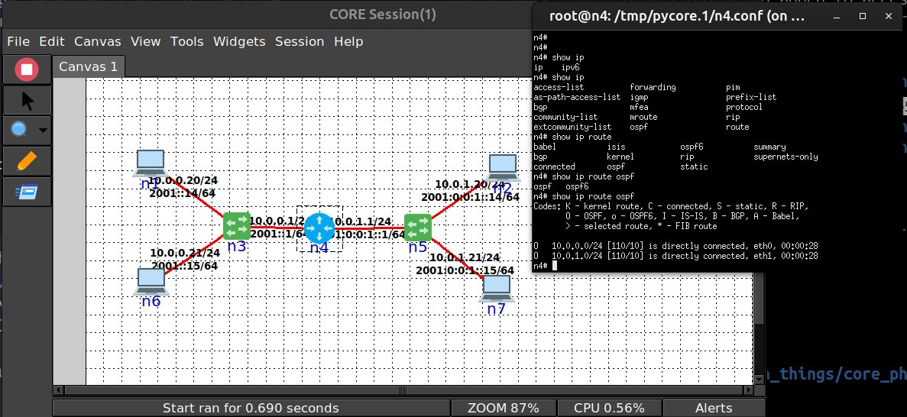

# Building CORE and EMANE Docker Images and Running CORE and EMANE in Containers

The documentation provides a guide on how to build CORE 
and EMANE images using the Dockerfile's in the CORE repo. The images are based off Ubuntu 22.04 images:

[Instructions for building a CORE Docker image](../docs/install_docker.md)

*Update 17/06/2025*: Successful running of core-daemon and core, with Quagga OSPF routing working.

## Basic reiteration of the image building process

From the root directory of this repository, execute the following commands in the terminal:

~~~
$ sudo docker build -t emane-python -f dockerfiles/Dockerfile.emane-python .
$ sudo docker build -t core -f dockerfiles/Dockerfile.ubuntu .
~~~

So 2 images are built from these commands and are tagged as:

1. emane-python
2. core

## Easy shell scripts to run and stop containers

After building the images above, the following script may be used for convenience.  To run a core container and get a bash shell into it:
~~~
$ bash 1-1_run_containers.sh
~~~

To stop the container do:
~~~
$ bash 1-2_stop_containers.sh
~~~

## Cleaning up a docker run session

Make sure you follow usual Docker clean up etiquette:
~~~
$ bash 1-3_stop_containers.sh
~~~

Or do it manually:
~~~
$ docker stop core
$ docker rm core
$ docker system prune
~~~

## Next steps

Some ideas for next steps:

1. Run python applications with venv in created hosts.  Say, a REST API.
2. Run docker applications in created hosts.
3. Run 'nrlsmf' in created hosts.
4. docker-compose or similar orchestration of multiple nodes in CORE.

