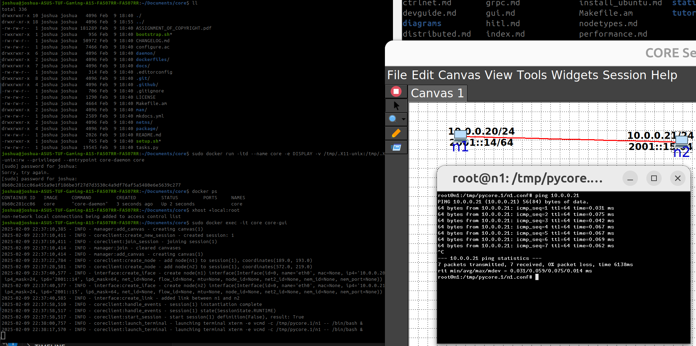

# Building CORE and EMANE Docker Images and Running CORE and EMANE in Containers

The documentation provides a guide on how to build CORE 
and EMANE iamges using the Dockerfile's in the CORE repo. The images are based
off Ubuntu 22.04 images:

[Instructions for building a CORE Docker image](../docs/install_docker.md)

*Update 09/02/2025*: I followed the `docker build`, `docker run` and `docker exec` terminal commands above and managed to get CORE running!

It builds a set of 3 images with the final one tagged as 'core' and runs a container named 'core'.

~~~
$ docker ps
CONTAINER ID   IMAGE     COMMAND         CREATED         STATUS         PORTS     NAMES
8b60c281cc06   core      "core-daemon"   3 seconds ago   Up 2 seconds             core
~~~

## Basic reiteration of the image building process

From the root directory of this repository, execute the following commands in the terminal:

~~~
$ sudo docker build -t emane-python -f dockerfiles/Dockerfile.emane-python .
$ sudo docker build -t ospf-deb -f dockerfiles/Dockerfile.ospf-mdr-deb .
$ sudo docker build -t core -f dockerfiles/Dockerfile.ubuntu .
~~~

So 3 images are built from these commands and are tagged as:

1. emane-python
2. ospf-deb
3. core

*Update 16/06/2025*: The final docker build command failed, and I suspect it is due to the following commands in the [Dockerfile](../dockerfiles/Dockerfile.ubuntu):

~~~
ARG CORE_PACKAGE=core_9.1.0_amd64.deb
RUN apt-get install -y --no-install-recommends ./${CORE_PACKAGE}
~~~

I checked the [CORE releases page](https://github.com/coreemu/core/releases/) and the version '9.1.0' no longer exists. So I updated the `CORE_PACKAGE` argument with what is available now i.e. `core_9.2.1_amd64.deb`.  The build now succeeds.

## Easy shell scripts to run and stop containers

After building the images above, the following script may be used for convenience.  To run a core container and get a bash shell into it:
~~~
$ bash 2_run_containers.sh
~~~

To stop the container do:
~~~
$ bash 3_stop_containers.sh
~~~

## Cleaning up a docker run session

Make sure you follow usual Docker clean up etiquette (the script [3_stop_containers.sh](./3_stop_containers.sh) does this):

~~~
$ docker stop core
$ docker rm core
$ docker system prune
~~~

## Next steps

Some ideas for next steps:

1. Run python applications with venv in created hosts.  Say, a REST API.
2. Run docker applications in created hosts.
3. Run 'nrlsmf' in created hosts.
4. docker-compose or similar orchestration of multiple nodes in CORE.

